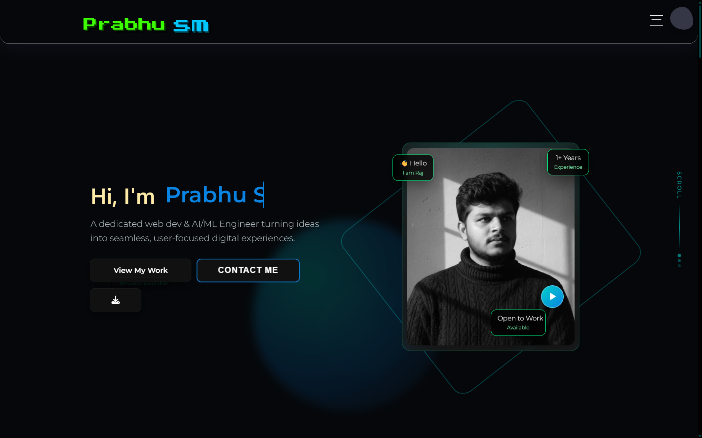
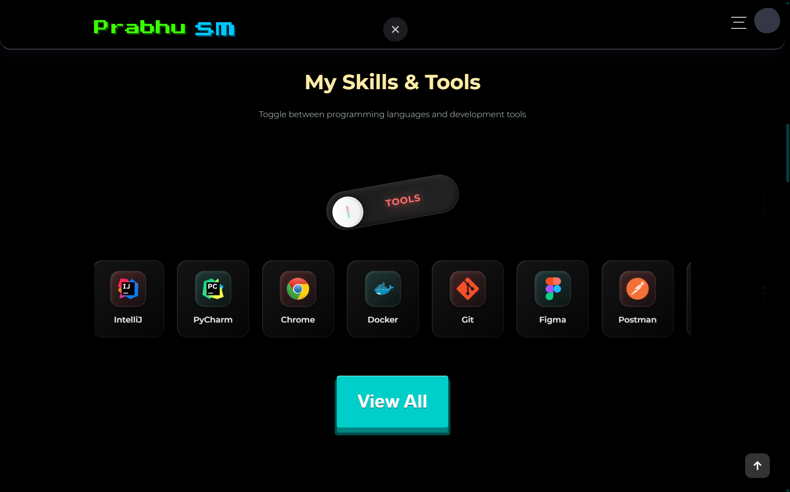
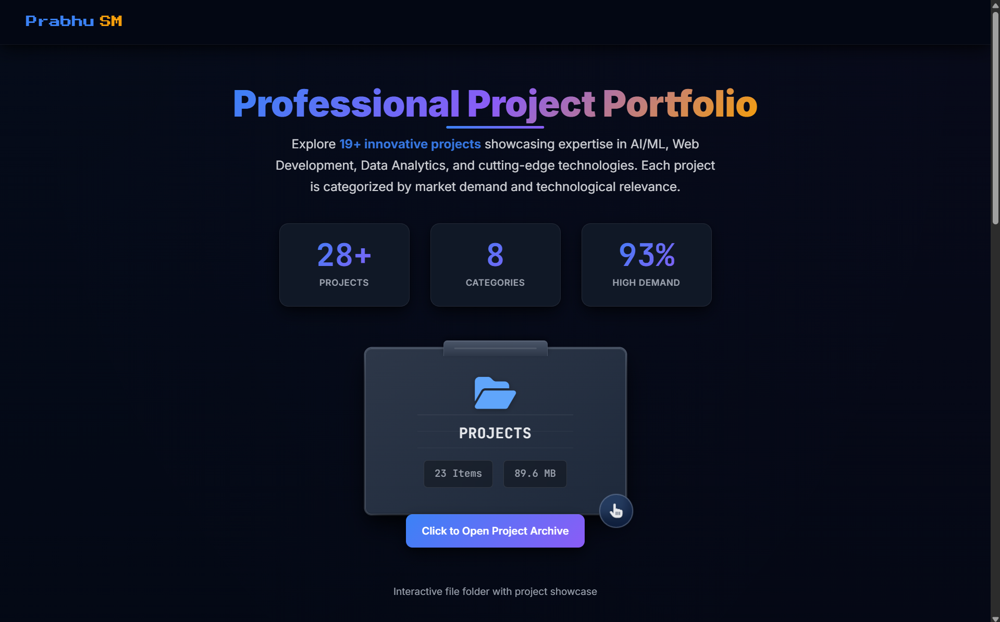

# 🌐 Prabhu Shankar Mund — Developer Portfolio

<p align="center">
  
  
  
  
</p>

<h3 align="center">
  🚀 <a href="https://prabhu-shankar-portfolio.vercel.app/">Visit Live Website</a> | 📁 <a href="#-project-structure">Project Structure</a> | 🤝 <a href="#-connect-with-me">Connect</a>
</h3>

---

## 📖 Overview

A **premium, modern, and highly interactive portfolio website** showcasing a journey through **AI/ML Engineering and Full-Stack Development**. This project is built for high-performance animations and sleek UI/UX, featuring a curated collection of **30+ projects**.

> "Code can be copied. Thinking, problem-solving ability, attitude, and intelligence cannot." — **Prabhu Shankar Mund**

---

## 📸 Visual Showcase

<table align="center">
  <tr>
    <td colspan="2" align="center">
      <b>🏠 Hero Section & Identity</b><br>
      
    </td>
  </tr>
  <tr>
    <td align="center" width="50%">
      <b>🔄 Interactive Skills</b><br>
      
    </td>
    <td align="center" width="50%">
      <b>📂 Project Portfolio</b><br>
      
    </td>
  </tr>
  <tr>
    <td align="center" colspan="2">
      <b>⚡ Modern 3D Loader</b><br>
      
    </td>
  </tr>
</table>

---

## ✨ Features

- **Responsive modern UI**: Optimized for all devices and screen sizes.
- **Animated interactions**: Powered by GSAP for a silky-smooth experience.
- **Project showcase system**: Dynamic grid featuring 30+ innovative works.
- **AI/ML focused branding**: Aesthetic reflecting expertise in intelligent systems.
- **Smooth navigation**: Intuitive scroll-based flow and interactive elements.
- **Live deployment**: Fast, reliable hosting with automated CI/CD.
- **Interactive sections**: Engaging components that respond to user input.

---

## 🛠️ Tech Stack

### Frontend & Animation
| Category | Technologies |
| :--- | :--- |
| **Core** | HTML5, CSS3, JavaScript (ES6+) |
| **Animation** | GSAP, ScrollTrigger, TextPlugin |
| **Styling** | Modern CSS (Flexbox, Grid), Custom Properties |

### Tools & Deployment
| Category | Technologies |
| :--- | :--- |
| **Deployment** | Vercel, Git/GitHub |
| **Design** | Figma, Adobe Suite |
| **Environment** | VS Code, Linux/Ubuntu |

---

## 🚀 Quick Start

To run this project locally, follow these simple steps:

1. **Clone the repository**
   ```bash
   git clone https://github.com/Rajmund09/prabhu-shankar-portfolio.git
   ```
2. **Navigate to the directory**
   ```bash
   cd prabhu-shankar-portfolio
   ```
3. **Open with Live Server**
   Simply open `index.html` in your browser or use the VS Code "Live Server" extension.

---

## 📁 Project Structure

```bash
PRABHU-PORTFOLIO/
├── 📂 screenshots/         # Showcase images for README
├── 📂 assets/              # PDF/DOCX Resumes and static assets
├── index.html              # Main application entry
├── style.css               # Core design system & styles
├── script.js               # GSAP animations & interactivity
└── README.md               # Documentation
```

---

## 🤝 Connect With Me

<p align="left">
  <a href="https://github.com/Rajmund09" target="_blank">
    
  </a>
  <a href="https://www.linkedin.com/in/prabhushankar-mund-216a5634a/" target="_blank">
    
  </a>
  <a href="https://x.com/Prabhushan60291" target="_blank">
    
  </a>
  <a href="https://www.instagram.com/raj___mund/" target="_blank">
    
  </a>
  <a href="https://wa.me/917978567667" target="_blank">
    
  </a>
</p>

---

<p align="center">
  <b>Building intelligent systems and creative digital experiences.</b><br>
  Developed with ❤️ by Prabhu Shankar Mund
</p>
