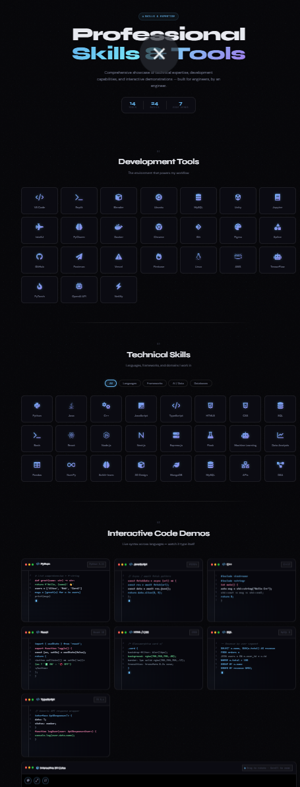

# <p align="center">🌐 Prabhu Shankar Mund — Developer Portfolio</p>

<p align="center">
  
  
  
</p>

<p align="center">
  
</p>

---

### <p align="center">🚀 [Visit Live Website](https://prabhu-shankar-portfolio.vercel.app/)</p>

---

## 📖 Overview

A **premium, modern, and highly interactive portfolio website** designed to showcase my journey as an **AI/ML Engineer and Full-Stack Developer**. This project focuses on high-performance animations, sleek UI/UX, and a comprehensive display of over **25+ projects** ranging from AI automation to creative web experiences.

> "Code can be copied. Thinking, problem-solving ability, attitude, and intelligence cannot." — **Prabhu Shankar Mund**

---

## 📸 Visual Showcase

### 🏠 Hero & Identity
*The core identity of the portfolio, featuring a dynamic 3D profile card and typing animations.*
<p align="center">
  
</p>

### 🛠️ Professional Skills & Tools
*A comprehensive display of expertise, featuring interactive toggles and detailed technology categories.*
<p align="center">
  
  
</p>

### 📂 Project Portfolio
*An interactive archive showcasing 25+ innovative projects across AI, Web, and Automation.*
<p align="center">
  
</p>

### ⚡ Creative Animations
*Custom 3D loaders and smooth transitions built with Three.js and GSAP.*
<p align="center">
  
</p>

---

## ✨ Key Features

### 🎨 Immersive UI/UX
- **Dark Mode Aesthetic**: A sleek, high-contrast interface with vibrant gradient accents.
- **Glassmorphism**: Modern UI elements with blurred backgrounds and soft shadows.
- **Micro-interactions**: Hover effects, button physics, and smooth state transitions.

### ⚡ Cutting-edge Animations
- **GSAP & ScrollTrigger**: Silky smooth scroll-based animations and entrance effects.
- **3D Interactive Profile**: Dynamic 3D card movement and interactive elements.
- **Text Typing Effects**: Dynamic hero text to highlight core expertise.

### 📱 Performance & Compatibility
- **Fully Responsive**: Optimized for every screen size — Mobile, Tablet, and Desktop.
- **Lightning Fast**: Optimized asset loading and lightweight frontend architecture.
- **SEO Optimized**: Semantic HTML and proper meta-tagging for maximum visibility.

---

## 🛠️ Tech Stack

### Frontend & Styling
<p>
  
  
  
</p>

### Animation & Graphics
<p>
  
  
</p>

### Deployment & Tools
<p>
  
  
  
</p>

---

## 📁 Project Structure

```bash
PORTFOLIO
├── 📂 assets/              # Static assets (Resume, icons)
│   └── 📂 resume/          # PDF and DOCX versions of CV
├── index.html              # Main entry point
├── style.css               # Core styling and animations
├── script.js               # GSAP logic and interactivity
├── phv.mp4                 # Introduction video
├── ppc.jpg                 # Hero preview image
└── prl.png                 # Brand logo/icon
```

---

## 💻 Local Development

Follow these steps to run the portfolio locally:

1. **Clone the Repo**
   ```bash
   git clone https://github.com/Rajmund09/prabhu-shankar-portfolio.git
   ```
2. **Navigate to Directory**
   ```bash
   cd prabhu-shankar-portfolio
   ```
3. **Run Locally**
   Simply open `index.html` in your favorite browser or use **Live Server** in VS Code.

---

## 🤝 Connect With Me

<p align="left">
  <a href="https://github.com/Rajmund09" target="_blank">
    
  </a>
  <a href="mailto:your-email@gmail.com" target="_blank">
    
  </a>
</p>

---

## ⭐ Support

If you find this project inspiring, feel free to:
- ⭐ **Star** the repository to show support!
- 🍴 **Fork** it to build your own version.
- 💡 **Suggest** improvements via issues.

<p align="center">
  <b>Building intelligent systems and creative digital experiences.</b><br>
  Developed with ❤️ by Prabhu Shankar Mund
</p>
